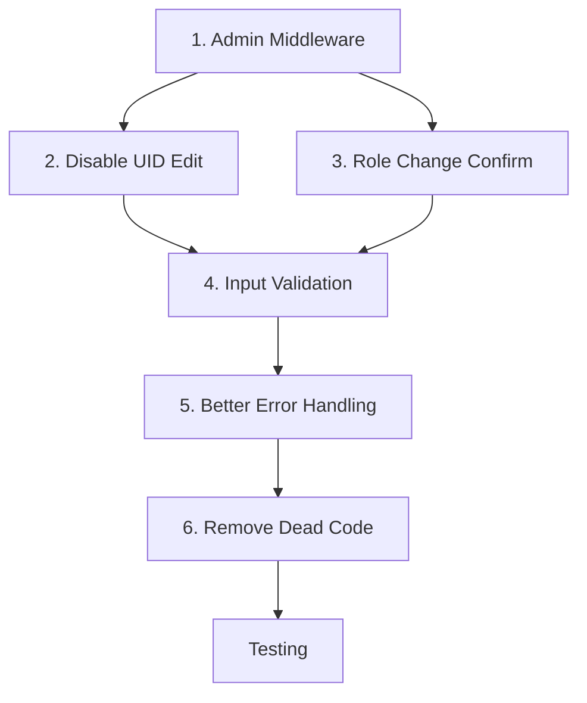

# Plan: Cải tiến Admin — Rút gọn cho Mini App

**Ngày tạo:** 2026-07-01
**Trạng thái:** ✅ **Đã hoàn thành**
**Tổng effort ước tính:** ~3-4 giờ
**Thời gian hoàn thành:** 2026-07-01

---

## Tổng quan

Vì đây là mini app nên chỉ tập trung vào **6 việc quan trọng nhất** — ưu tiên bảo mật và UX cốt lõi:

| STT | Việc | Độ ưu tiên | Time |
|-----|------|-----------|------|
| 1 | Tạo Admin Middleware — bảo vệ tất cả API admin | 🔴 Critical | 1.5h |
| 2 | Vô hiệu hóa chỉnh sửa UID trong Edit User | 🔴 Critical | 5min |
| 3 | Xác nhận khi thay đổi role → admin | 🔴 Critical | 5min |
| 4 | Validate input khi tạo user mới | 🟠 High | 30min |
| 5 | Hiển thị lỗi thân thiện (thay alert/console.error) | 🟠 High | 30min |
| 6 | Xóa dead code `sessionStorage.removeItem` | 🟠 High | 2min |

---

## Chi tiết từng việc

### 1. Tạo Admin Middleware

**Mục tiêu:** Centralized middleware để kiểm tra admin role — đảm bảo không route nào bị bỏ sót.

f
**Vấn đề:** Các admin API route hiện tại (`src/app/api/admin/redeem-requests/route.ts` v.v.) **không check admin role**. Bất kỳ ai biết URL đều có thể gọi.

**File mới:** [`src/lib/admin-middleware.ts`](src/lib/admin-middleware.ts)

```typescript
import { NextRequest, NextResponse } from "next/server";
import { getCurrentUser } from "@/lib/auth";
import { userRepository } from "@/lib/repository";

export async function requireAdmin(req: NextRequest): Promise<NextResponse | null> {
    try {
        const session = await getCurrentUser();
        if (!session) {
            return NextResponse.json({ error: "Unauthorized" }, { status: 401 });
        }

        const user = await userRepository.getUserById(session.userId);
        if (!user || user.role !== "admin") {
            return NextResponse.json({ error: "Forbidden" }, { status: 403 });
        }

        return null; // null = admin confirmed, proceed
    } catch {
        return NextResponse.json({ error: "Internal Server Error" }, { status: 500 });
    }
}
```

**Apply cho tất cả admin routes (8 file):**
- `src/app/api/admin/redeem-requests/route.ts`
- `src/app/api/admin/redeem-requests/[id]/approve/route.ts`
- `src/app/api/admin/redeem-requests/[id]/reject/route.ts`
- `src/app/api/admin/users/route.ts`
- `src/app/api/admin/users/[id]/route.ts`
- `src/app/api/admin/stats/route.ts`
- `src/app/api/admin/import-volume/route.ts`
- `src/app/api/admin/export-stats/route.ts`

**Pattern apply:**
```typescript
import { requireAdmin } from "@/lib/admin-middleware";

export async function GET(req: NextRequest) {
    const adminCheck = requireAdmin(req);
    if (adminCheck) return adminCheck;
    // ... existing logic
}
```

---

### 2. Vô hiệu hóa chỉnh sửa UID

**File:** [`src/components/UserManagementTable.tsx`](src/components/UserManagementTable.tsx) dòng 552-558

**Problem:** UID là unique identifier — cho phép chỉnh sửa gây inconsistency trong database.

**Current:**
```tsx
<input
    placeholder="UID"
    value={editUser.uid}
    onChange={(e) => setEditUser({ ...editUser, uid: e.target.value })}
    className="w-full h-11 border rounded-xl px-4 text-sm"
/>
```

**Fix:**
```tsx
<input
    placeholder="UID"
    value={editUser.uid}
    disabled
    className="w-full h-11 border rounded-xl px-4 text-sm bg-gray-100 text-gray-500 cursor-not-allowed"
/>
```

---

### 3. Xác nhận thay đổi role → admin

**File:** [`src/components/UserManagementTable.tsx`](src/components/UserManagementTable.tsx) dòng 594-603

**Problem:** Thay đổi role từ user → admin quá dễ — có thể click nhầm.

**Current:**
```tsx
<select
    value={editUser.role}
    onChange={(e) => setEditUser({ ...editUser, role: e.target.value })}
>
    <option value="user">user</option>
    <option value="admin">admin</option>
</select>
```

**Fix:**
```tsx
<select
    value={editUser.role}
    onChange={(e) => {
        if (e.target.value === "admin" && editUser.role !== "admin") {
            if (!confirm(`Cảnh báo: Nâng quyền "${editUser.name}" thành admin.`)) return;
        }
        setEditUser({ ...editUser, role: e.target.value });
    }}
>
    <option value="user">user</option>
    <option value="admin">admin</option>
</select>
```

---

### 4. Validate input khi tạo user

**File:** [`src/components/UserManagementTable.tsx`](src/components/UserManagementTable.tsx) dòng 117-149

**Problem:** `handleCreateUser()` gọi API trực tiếp không có validation client-side.

**Fix — thêm validation trước khi gọi API:**
```tsx
async function handleCreateUser() {
    // Validate
    if (!newUser.uid.trim()) { alert("Vui lòng nhập UID"); return; }
    if (!newUser.name.trim()) { alert("Vui lòng nhập tên"); return; }
    if (!newUser.telegram_id.trim()) { alert("Vui lòng nhập Telegram ID"); return; }
    if (isNaN(Number(newUser.telegram_id))) { alert("Telegram ID phải là số"); return; }
    if (!newUser.password || newUser.password.length < 6) { alert("Mật khẩu tối thiểu 6 ký tự"); return; }

    // ... existing createUser() call
}
```

---

### 5. Hiển thị lỗi thân thiện (thay alert/console.error)

**File:** [`src/components/RedeemRequestTable.tsx`](src/components/RedeemRequestTable.tsx)

**Current:**
```tsx
const loadData = async () => {
    try {
        setLoading(true);
        const res = await getRedeemRequests(status, page, limit);
        setItems(res.items ?? []);
        setTotal(res.total ?? 0);
    } catch (error) {
        console.error(error); // <-- Không hiển thị cho user
    } finally {
        setLoading(false);
    }
};
```

**Fix:**
```tsx
const [error, setError] = useState<string | null>(null);

const loadData = async () => {
    try {
        setLoading(true);
        setError(null);
        const res = await getRedeemRequests(status, page, limit);
        setItems(res.items ?? []);
        setTotal(res.total ?? 0);
    } catch (error) {
        const message = error instanceof Error ? error.message : "Không thể tải dữ liệu";
        setError(message);
    } finally {
        setLoading(false);
    }
};
```

Và thêm trong render (sau loading check):
```tsx
if (error) {
    return (
        <div className="bg-white rounded-2xl p-6 text-center">
            <p className="text-red-500 mb-2">{error}</p>
            <button onClick={loadData} className="px-4 py-2 bg-red-100 rounded-lg text-red-600 text-sm">
                Thử lại
            </button>
        </div>
    );
}
```

---

### 6. Xóa dead code

**File:** [`src/components/RedeemRequestTable.tsx`](src/components/RedeemRequestTable.tsx) dòng 133

**Current:**
```tsx
sessionStorage.removeItem("rewards");
```

**Fix:** Xóa dòng này. Đây là dead code — copy nhầm từ Home page.

---

## Dependency Graph



---

## Files cần sửa

| File | Changes |
|------|---------|
| `src/lib/admin-middleware.ts` | **MỚI** — Centralized admin auth middleware |
| `src/app/api/admin/redeem-requests/route.ts` | Apply `requireAdmin()` |
| `src/app/api/admin/redeem-requests/[id]/approve/route.ts` | Apply `requireAdmin()` |
| `src/app/api/admin/redeem-requests/[id]/reject/route.ts` | Apply `requireAdmin()` |
| `src/app/api/admin/users/route.ts` | Apply `requireAdmin()` |
| `src/app/api/admin/users/[id]/route.ts` | Apply `requireAdmin()` |
| `src/app/api/admin/stats/route.ts` | Apply `requireAdmin()` |
| `src/app/api/admin/import-volume/route.ts` | Apply `requireAdmin()` |
| `src/app/api/admin/export-stats/route.ts` | Apply `requireAdmin()` |
| `src/components/UserManagementTable.tsx` | UID disabled, role confirm, input validation |
| `src/components/RedeemRequestTable.tsx` | Error handling, xóa dead code |

---

## Testing Checklist

- [x] Non-admin user truy cập admin API → nhận 403
- [x] Không có session → nhận 401
- [x] Edit user → UID không thể chỉnh sửa (disabled)
- [x] Thay đổi role từ user → admin → xuất hiện confirm dialog
- [x] Tạo user với dữ liệu trống/invalid → hiển thị lỗi validation
- [x] API lỗi → hiển thị message + nút "Thử lại"
- [x] Không còn `console.error` trong RedeemRequestTable
- [x] Không còn dòng `sessionStorage.removeItem("rewards")`

---

## Chi tiết đã sửa

### 1. Admin Middleware (`src/lib/admin-middleware.ts`)
- Tạo file middleware với 2 hàm: `requireAdmin()` (throw error nếu không admin) và `adminResponse()` (return NextResponse JSON)
- Pattern: `try { await requireAdmin(req); } catch { return adminResponse("Unauthorized", 401); }`

### 2. Bảo vệ 8 Admin API Routes
- [`src/app/api/admin/redeem-requests/route.ts`](src/app/api/admin/redeem-requests/route.ts) — GET
- [`src/app/api/admin/redeem-requests/[id]/approve/route.ts`](src/app/api/admin/redeem-requests/[id]/approve/route.ts) — POST
- [`src/app/api/admin/redeem-requests/[id]/reject/route.ts`](src/app/api/admin/redeem-requests/[id]/reject/route.ts) — POST
- [`src/app/api/admin/users/route.ts`](src/app/api/admin/users/route.ts) — GET, POST
- [`src/app/api/admin/users/[id]/route.ts`](src/app/api/admin/users/[id]/route.ts) — PUT, DELETE
- [`src/app/api/admin/stats/route.ts`](src/app/api/admin/stats/route.ts) — GET
- [`src/app/api/admin/import-volume/route.ts`](src/app/api/admin/import-volume/route.ts) — POST
- [`src/app/api/admin/export-stats/route.ts`](src/app/api/admin/export-stats/route.ts) — GET

### 3. UserManagementTable.tsx (`src/components/UserManagementTable.tsx`)
- **Dòng 543:** UID input thêm `disabled` + `bg-gray-100 text-gray-500 cursor-not-allowed`
- **Dòng 585:** Role select thêm `onChange` check — nếu nâng lên admin → `confirm()` dialog
- **Dòng 117:** `handleCreateUser()` validate: UID, name, telegram_id (rỗng + số), password (tối thiểu 6 ký tự) → `alert()`

### 4. RedeemRequestTable.tsx (`src/components/RedeemRequestTable.tsx`)
- Thêm `error` state, catch lỗi trong `loadData()`, hiển thị message + nút "Thử lại"
- Xóa `sessionStorage.removeItem("rewards")` — dead code

## Bỏ qua (mini app không cần)

- Toast notification system
- URL sync cho pagination
- Skeleton loading
- Date range filter
- Search trong redeem requests
- Export all data
- Preview CSV khi import
- Password show/hide toggle
- Keyboard shortcuts
