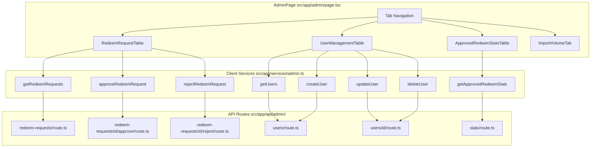
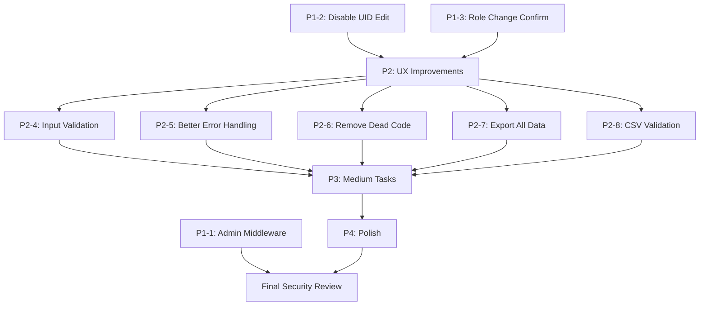

# Plan: Cải tiến chức năng Admin — Check Reward Mini App

**Ngày tạo:** 2026-07-01
**Trạng thái:** ✅ **Đã implement** (6/20 items — simplified scope)
**Ghi chú:** Chỉ 6 việc critical/high được thực hiện. Các item khác bỏ vì mini-app scope.

---

## Mục lục

1. [Tổng quan](#tổng-quan)
2. [Kiến trúc hiện tại](#kiến-trúc-hiện-tại)
3. [Nhận xét chi tiết theo Tab](#nhận-xét-chi-tiết-theo-tab)
4. [Issues identified](#issues-identified)
5. [Priority Plan](#priority-plan)
6. [Dependency Graph](#dependency-graph)
7. [Testing Strategy](#testing-strategy)

---

## Tổng quan

Admin page có 4 tabs chính:

| Tab | Component | API Services | Mô tả |
|---|---|---|---|
| Duyệt quà | [`RedeemRequestTable.tsx`](src/components/RedeemRequestTable.tsx) | `getRedeemRequests`, `approveRedeemRequest`, `rejectRedeemRequest` | Xem và approve/reject yêu cầu đổi quà |
| Quản lý User | [`UserManagementTable.tsx`](src/components/UserManagementTable.tsx) | `getUsers`, `createUser`, `updateUser`, `deleteUser` | CRUD users (uid, name, role, telegram_id) |
| Danh sách đổi quà | [`ApprovedRedeemStatsTable.tsx`](src/components/ApprovedRedeemStatsTable.tsx) | `getApprovedRedeemStats`, `exportExcel` | Xem thống kê và export Excel |
| Import Volume | [`ImportVolumeTab.tsx`](src/components/ImportVolumeTab.tsx) | `import-volume` API | Import volume từ CSV |

---

## Kiến trúc hiện tại



### Load Data Pattern

Tất cả các table components đều dùng pattern tương tự:

```tsx
const [page, setPage] = useState(1)
const [loading, setLoading] = useState(true)
const [items, setItems] = useState([])
const [total, setTotal] = useState(0)

useEffect(() => {
    loadData()
}, [page, /* filter params */])
```

---

## Nhận xét chi tiết theo Tab

### 1. RedeemRequestTable (`RedeemRequestTable.tsx`)

#### ✅ Điểm Tốt
1. **Filter tabs UI** — Có filter theo status (all/pending/approved/rejected)
2. **User detail modal** — Click vào tên user xem thông tin giao hàng
3. **Loading state** — Hiển thị "Đang tải dữ liệu..." khi đang load
4. **Empty state** — Hiển thị "KHÔNG CÓ YÊU CẦU ĐỔI QUÀ" khi không có data
5. **Submit protection** — `setSubmitting` state prevent double submit
6. **Pagination UI** — Có prev/next buttons với disabled state

#### ⚠️ Vấn đề
1. **Error handling yếu** — `console.error(error)` thay vì hiển thị cho user
2. **Dead code** — `sessionStorage.removeItem("rewards")` dòng 133 không có tác dụng
3. **Alert-based** — `alert("Approve failed")` thay vì toast
4. **Không có refetch on focus** — Sau khi approve/reject, phải tự refresh mới thấy update
5. **No confirmation for approve** — Chỉ có modal, không có secondary confirmation
6. **Static page state** — Không có URL sync (page state lost on refresh)

---

### 2. UserManagementTable (`UserManagementTable.tsx`)

#### ✅ Điểm Tốt
1. **Search by UID** — Input filter theo UID
2. **Pagination** — Có phân trang 10 items/page
3. **Create modal** — Form đầy đủ: uid, name, telegram_id, password
4. **Edit modal** — Form sửa: uid, name, telegram_id, role (user/admin)
5. **Delete confirmation** — `confirm()` trước khi xóa

#### ⚠️ Vấn đề
1. **No input validation** — Không validate uid, name, telegram_id, password
2. **Password plain text input** — Password field `type="password"` nhưng không có show/hide toggle
3. **No success toast** — Chỉ gọi `loadUsers()` sau create/update
4. **Edit form allows changing UID** — UID là unique identifier, không nên cho sửa
5. **Role change có thể nguy hiểm** — Cho phép nâng user → admin mà không có confirmation
6. **Telegram ID không validate format** — Accept bất kỳ string nào
7. **Dead code pattern** — Tương tự home page: reload toàn bộ table thay vì optimistic update

---

### 3. ApprovedRedeemStatsTable (`ApprovedRedeemStatsTable.tsx`)

#### ✅ Điểm Tốt
1. **Excel export** — Có export với Telegram WebApp compatibility
2. **Sticky table headers** — `table-sticky` class cho fixed header khi scroll
3. **Scrollable container** — `max-h-[calc(100vh-240px)]` với custom scroll
4. **Calculates total points** — `required_points * quantity` inline

#### ⚠️ Vấn đề
1. **No filter by date range** — Không thể filter theo khoảng thời gian
2. **Export chỉ export current page** — Export 10 items thay vì all data
3. **No search/filter** — Không thể tìm theo user/reward
4. **Static pagination** — Không có URL sync

---

### 4. ImportVolumeTab (`ImportVolumeTab.tsx`)

#### ✅ Điểm Tốt
1. **Client-side CSV parsing** — Dùng PapaParse để parse trước khi gửi server
2. **Custom delimiter** — Hỗ trợ semicolon `;` separator
3. **Error handling** — Show error khi file invalid hoặc server lỗi
4. **Result display** — Hiển thị số dòng đã import / skip
5. **Loading state** — Button disable khi đang xử lý

#### ⚠️ Vấn đề
1. **No CSV validation** — Không validate CSV structure trước khi parse
2. **No preview** — Không xem trước dữ liệu trước khi import
3. **No file type validation** — `accept=".csv"` nhưng có thể upload file khác
4. **No file size limit check** — Có thể upload file CSV rất lớn
5. **No undo/retry** — Import失败了 thì phải upload lại từ đầu
6. **No progress indicator** — Không có progress bar cho large files

---

## Issues Identified

### 🔴 Critical

| # | Vấn đề | File | Impact |
|---|---|---|---|
| 1 | Không có admin middleware protection | Multiple route.ts files | Bất kỳ ai cũng có thể truy cập admin API nếu biết URL |
| 2 | UID editable trong Edit User modal | `UserManagementTable.tsx:552` | UID là unique identifier, sửa UID gây inconsistency |
| 3 | Role change không có confirmation | `UserManagementTable.tsx:596` | Nâng user → admin dễ gây security issue |

### 🟠 High

| # | Vấn đề | File | Impact |
|---|---|---|---|
| 4 | No input validation on create user | `UserManagementTable.tsx:438-493` | Có thể tạo user với dữ liệu invalid |
| 5 | Error handling chỉ console.error | `RedeemRequestTable.tsx:82-83` | User không biết khi nào API failed |
| 6 | Dead code sessionStorage | `RedeemRequestTable.tsx:133` | Code nhầm lẫn từ Home page |
| 7 | Export chỉ export current page | `ApprovedRedeemStatsTable.tsx:51` | Export incomplete data |
| 8 | No CSV validation/preview | `ImportVolumeTab.tsx:27` | Import có thể fail silently |
| 9 | Alert-based UX across all tabs | Multiple files | Poor user experience |

### 🟡 Medium

| # | Vấn đề | File |
|---|---|---|
| 10 | No date range filter on stats | `ApprovedRedeemStatsTable.tsx` |
| 11 | No search on redeem requests | `RedeemRequestTable.tsx` |
| 12 | No refetch on focus | `RedeemRequestTable.tsx`, `UserManagementTable.tsx` |
| 13 | Telegram ID không validate | `UserManagementTable.tsx` |
| 14 | Password field no show/hide | `UserManagementTable.tsx:486` |
| 15 | No file size validation | `ImportVolumeTab.tsx` |
| 16 | Pagination không có URL sync | All table components |

### 🟢 Low

| # | Vấn đề | File |
|---|---|---|
| 17 | Hardcoded limit = 10 | All table components |
| 18 | No skeleton loading on tables | All table components |
| 19 | Inconsistent spacing/alignment | All components |
| 20 | No keyboard shortcuts | All components |

---

## Priority Plan

### Priority 1 — Critical (Security & Data Integrity)

#### Issue #1: Add Admin Middleware Protection

**Current:** Mỗi route tự check admin role → dễ bỏ sót

**Fix:** Tạo centralized admin middleware

```typescript
// src/lib/admin-middleware.ts
import { NextRequest, NextResponse } from "next/server";
import { getCurrentUser } from "@/lib/auth";
import { userRepository } from "@/lib/repository";

export async function requireAdmin(req: NextRequest): Promise<NextResponse | null> {
    try {
        const session = await getCurrentUser();
        if (!session) {
            return NextResponse.json({ error: "Unauthorized" }, { status: 401 });
        }

        const user = await userRepository.getUserById(session.userId);
        if (!user || user.role !== "admin") {
            return NextResponse.json({ error: "Forbidden" }, { status: 403 });
        }

        return null; // null = admin confirmed, proceed
    } catch {
        return NextResponse.json({ error: "Internal Server Error" }, { status: 500 });
    }
}
```

**Apply cho tất cả admin routes:**
```typescript
// src/app/api/admin/redeem-requests/route.ts
import { requireAdmin } from "@/lib/admin-middleware";

export async function GET(req: NextRequest) {
    const adminCheck = requireAdmin(req);
    if (adminCheck) return adminCheck;
    // ... existing logic
}
```

**Estimated effort:** 2 hours

---

#### Issue #2: Disable UID editing in Edit User modal

**File:** [`UserManagementTable.tsx:552`](src/components/UserManagementTable.tsx:552)

**Current:**
```tsx
<input
    value={editUser.uid}
    onChange={(e) => setEditUser({ ...editUser, uid: e.target.value })}
/>
```

**Fix:**
```tsx
<input
    value={editUser.uid}
    disabled
    className="w-full h-11 border rounded-xl px-4 text-sm bg-gray-100 text-gray-500 cursor-not-allowed"
/>
```

**Estimated effort:** 5 minutes

---

#### Issue #3: Add confirmation for role change

**File:** [`UserManagementTable.tsx`](src/components/UserManagementTable.tsx:596)

**Fix:**
```tsx
<select
    value={editUser.role}
    onChange={(e) => {
        if (e.target.value === "admin" && editUser.role !== "admin") {
            if (!confirm(`Nâng quyền ${editUser.name} thành admin? Hành động này không thể hoàn tác.`)) {
                return;
            }
        }
        setEditUser({ ...editUser, role: e.target.value });
    }}
>
    <option value="user">user</option>
    <option value="admin">admin</option>
</select>
```

**Estimated effort:** 10 minutes

---

### Priority 2 — High (UX & Error Handling)

#### Issue #4: Input validation on create user

**File:** [`UserManagementTable.tsx`](src/components/UserManagementTable.tsx:117)

**Fix:**
```typescript
async function handleCreateUser() {
    // Validate
    if (!newUser.uid?.trim()) {
        alert("Vui lòng nhập UID");
        return;
    }
    if (!newUser.name?.trim()) {
        alert("Vui lòng nhập tên");
        return;
    }
    if (!newUser.telegram_id?.trim()) {
        alert("Vui lòng nhập Telegram ID");
        return;
    }
    if (isNaN(Number(newUser.telegram_id))) {
        alert("Telegram ID phải là số");
        return;
    }
    if (!newUser.password?.trim() || newUser.password.length < 6) {
        alert("Mật khẩu phải có ít nhất 6 ký tự");
        return;
    }

    try {
        setLoading(true);
        await createUser({
            uid: newUser.uid.trim(),
            name: newUser.name.trim(),
            telegram_id: Number(newUser.telegram_id),
            password: newUser.password,
        });
        setShowCreate(false);
        setNewUser({ uid: "", name: "", telegram_id: "", password: "" });
        await loadUsers();
    } catch (error) {
        alert(error instanceof Error ? error.message : "Tạo user thất bại");
    } finally {
        setLoading(false);
    }
}
```

**Estimated effort:** 30 minutes

---

#### Issue #5: Better error handling in RedeemRequestTable

**File:** [`RedeemRequestTable.tsx`](src/components/RedeemRequestTable.tsx:82)

**Fix:**
```tsx
const [error, setError] = useState<string | null>(null);

const loadData = async () => {
    try {
        setLoading(true);
        setError(null);
        const res = await getRedeemRequests(status, page, limit);
        setItems(res.items ?? []);
        setTotal(res.total ?? 0);
    } catch (error) {
        const message = error instanceof Error ? error.message : "Failed to load data";
        setError(`Không thể tải dữ liệu: ${message}`);
    } finally {
        setLoading(false);
    }
};

// In render:
if (loading) {
    return <div className="bg-white rounded-2xl p-6 text-center text-gray-500">Đang tải dữ liệu...</div>;
}

if (error) {
    return (
        <div className="bg-white rounded-2xl p-6 text-center">
            <p className="text-red-500 mb-2">{error}</p>
            <button onClick={loadData} className="px-4 py-2 bg-red-100 rounded-lg text-red-600">
                Thử lại
            </button>
        </div>
    );
}
```

**Estimated effort:** 20 minutes

---

#### Issue #6: Remove dead code sessionStorage

**File:** [`RedeemRequestTable.tsx:133`](src/components/RedeemRequestTable.tsx:133)

**Fix:** Xóa dòng `sessionStorage.removeItem("rewards");`

**Estimated effort:** 2 minutes

---

#### Issue #7: Export all data instead of current page only

**File:** [`ApprovedRedeemStatsTable.tsx:51`](src/components/ApprovedRedeemStatsTable.tsx:51)

**Fix:** Thêm query parameter `export=1` để export tất cả data:

```typescript
function exportExcel() {
    // Check if should export all data or just current page
    const totalItems = getTotalItems(); // Need to fetch total first
    const shouldExportAll = shouldExportAll; // User chooses or auto-detect

    const params = shouldExportAll
        ? "?export=1"
        : `?page=${page}&limit=${limit}&export=1`;

    const url = `${window.location.origin}/api/admin/export-stats${params}`;

    if (window.Telegram?.WebApp) {
        window.Telegram.WebApp.openLink(url);
    } else {
        window.open(url, "_blank");
    }
}
```

**Cần thêm backend support:**
```typescript
// src/app/api/admin/export-stats/route.ts
const exportAll = req.nextUrl.searchParams.get("export") === "1";
if (exportAll) {
    // Fetch all records without pagination
    const allItems = await getApprovedRedeemStatsNoPagination();
    // Export to Excel
}
```

**Estimated effort:** 1 hour

---

#### Issue #8: CSV validation & preview before import

**File:** [`ImportVolumeTab.tsx`](src/components/ImportVolumeTab.tsx:27)

**Fix:** Thêm preview modal trước khi import:

```tsx
const [previewData, setPreviewData] = useState<Record<string, string>[]>([]);
const [isValidCSV, setIsValidCSV] = useState(false);

const handleFileSelect = (file: File) => {
    if (!file) return;

    // Validate file type
    if (!file.name.toLowerCase().endsWith(".csv")) {
        setError("Vui lòng chọn file CSV");
        return;
    }

    // Validate file size (max 5MB)
    if (file.size > 5 * 1024 * 1024) {
        setError("File quá lớn (tối đa 5MB)");
        return;
    }

    Papa.parse(file, {
        header: true,
        delimiter: ";",
        skipEmptyLines: true,
        preview: 10, // Preview first 10 rows
        complete: (parsed) => {
            if (parsed.data.length === 0) {
                setError("File trống");
                return;
            }
            setPreviewData(parsed.data);
            setIsValidCSV(true);
        },
    });
};

// Add preview modal before import
{previewData.length > 0 && (
    <div className="bg-gray-50 rounded-xl p-4 max-h-64 overflow-y-auto">
        <h4 className="text-sm font-medium mb-2">Xem trước dữ liệu ({previewData.length} dòng)</h4>
        <table className="w-full text-xs">
            <thead>
                <tr className="text-gray-500">
                    {Object.keys(previewData[0] || {}).map(key => (
                        <th key={key} className="text-left px-2 py-1">{key}</th>
                    ))}
                </tr>
            </thead>
            <tbody>
                {previewData.slice(0, 5).map((row, i) => (
                    <tr key={i} className="border-t">
                        {Object.values(row).map((val, j) => (
                            <td key={j} className="px-2 py-1">{val}</td>
                        ))}
                    </tr>
                ))}
            </tbody>
        </table>
        {previewData.length > 5 && (
            <p className="text-xs text-gray-400 mt-1">... và {previewData.length - 5} dòng nữa</p>
        )}
    </div>
)}

<button
    onClick={handleImport}
    disabled={loading || !isValidCSV}
>
    {loading ? "Đang xử lý..." : "Import"}
</button>
```

**Estimated effort:** 1.5 hours

---

### Priority 3 — Medium (Architecture & DX)

#### Issue #10-16: Medium Priority Tasks

| # | Task | Estimated Time |
|---|---|---|
| 10 | Add date range filter on stats | 1 hour |
| 11 | Add search on redeem requests | 45 min |
| 12 | Add refetch on focus | 30 min |
| 13 | Validate Telegram ID format | 15 min |
| 14 | Add password show/hide toggle | 15 min |
| 15 | Add file size validation on import | 10 min |
| 16 | Add URL sync for pagination | 2 hours |

---

### Priority 4 — Low (Polish)

| # | Task | Estimated Time |
|---|---|---|
| 17 | Make limit configurable | 20 min |
| 18 | Add skeleton loading on tables | 1 hour |
| 19 | Consistent spacing/alignment | 30 min |
| 20 | Keyboard shortcuts | 30 min |
| **Toast notification integration** | Same as Home page improvements | 1 hour |

---

## Dependency Graph



---

## Recommended Implementation Order

| Step | Task | Time |
|---|---|---|
| 1 | Add admin middleware (P1-1) | 2 hours |
| 2 | Disable UID edit (P1-2) | 5 min |
| 3 | Role change confirmation (P1-3) | 10 min |
| 4 | Remove dead code (P2-6) | 2 min |
| 5 | Input validation on create (P2-4) | 30 min |
| 6 | Better error handling (P2-5) | 20 min |
| 7 | CSV validation & preview (P2-8) | 1.5 hours |
| 8 | Export all data (P2-7) | 1 hour |
| 9 | Password show/hide (P3-14) | 15 min |
| 10 | Telegram ID validation (P3-13) | 15 min |
| 11 | Search on redeem requests (P3-11) | 45 min |
| 12 | Date range filter (P3-10) | 1 hour |
| 13 | URL sync pagination (P3-16) | 2 hours |
| 14 | Add skeleton loading (P4-18) | 1 hour |
| 15 | Toast notifications (P4) | 1 hour |
| 16 | Fix spacing/alignment (P4-19) | 30 min |
| 17 | Make limit configurable (P4-17) | 20 min |
| 18 | File size validation (P3-15) | 10 min |
| 19 | Keyboard shortcuts (P4-20) | 30 min |
| 20 | Add refetch on focus (P3-12) | 30 min |

**Total estimated effort:** ~9-10 hours

---

## Files cần sửa

| File | Changes |
|---|---|
| `src/lib/admin-middleware.ts` | **(New)** Centralized admin auth middleware |
| `src/app/admin/page.tsx` | Minor cleanup |
| `src/components/RedeemRequestTable.tsx` | Error handling, dead code, search filter |
| `src/components/UserManagementTable.tsx` | UID disabled, validation, password toggle, role confirmation |
| `src/components/ApprovedRedeemStatsTable.tsx` | Date range filter, export all data |
| `src/components/ImportVolumeTab.tsx` | CSV validation, file size check, preview |
| `src/app/services/admin.ts` | Add exportAll parameter |
| `src/app/api/admin/*/route.ts` | Apply admin middleware |
| `src/components/Toast.tsx` | (Shared with Home page improvements) |

---

## Testing Strategy

### Manual Tests

**RedeemRequestTable:**
- [x] Error handling: disconnect network → verify error state + retry button
- [ ] Filter by status (all/pending/approved/rejected)
- [ ] Approve request → verify status update
- [ ] Reject request with reason → verify status update
- [ ] Click user name → verify detail modal
- [ ] Pagination: test prev/next, boundary conditions

**UserManagementTable:**
- [x] Create user with valid data → verify success
- [x] Create user with empty uid → verify error
- [x] Create user with short password → verify error
- [x] Edit user → verify UID is disabled
- [x] Change role to admin → verify confirmation dialog
- [ ] Delete user → verify confirmation dialog
- [ ] Search by UID → verify filtering

**ApprovedRedeemStatsTable:**
- [ ] Export Excel → verify download
- [ ] Export all data → verify all records included
- [ ] Date range filter → verify filtering

**ImportVolumeTab:**
- [ ] Upload valid CSV → verify preview + import
- [ ] Upload invalid CSV → verify error
- [ ] Upload file > 5MB → verify error
- [ ] Upload non-CSV file → verify error
- [ ] Cancel import before confirming → verify no data sent

### Security Tests

- [x] Non-admin user tries to access admin API → verify 403
- [x] No auth token → verify 401
- [ ] Invalid JWT → verify 401
- [ ] Try to access admin pages directly (URL) without auth → verify redirect

---

## ✅ Đã Hoàn thành (6/20 items)

| # | Issue | Trạng thái |
|---|-------|-----------|
| 1 | Admin Middleware Protection | ✅ Đã implement — [`src/lib/admin-middleware.ts`](src/lib/admin-middleware.ts), áp dụng cho 8 admin routes |
| 2 | Disable UID editing | ✅ Đã implement — [`UserManagementTable.tsx`](src/components/UserManagementTable.tsx:543) |
| 3 | Role change confirmation | ✅ Đã implement — [`UserManagementTable.tsx`](src/components/UserManagementTable.tsx:585) |
| 4 | Input validation on create | ✅ Đã implement — [`UserManagementTable.tsx`](src/components/UserManagementTable.tsx:117) |
| 5 | Better error handling | ✅ Đã implement — [`RedeemRequestTable.tsx`](src/components/RedeemRequestTable.tsx) |
| 6 | Remove dead code | ✅ Đã implement — xóa `sessionStorage.removeItem("rewards")` |

**Bỏ qua (mini-app scope):** Items 7-20 (date filters, bulk operations, CSV preview, skeleton loading, toast notifications, URL sync, export improvements, etc.)
