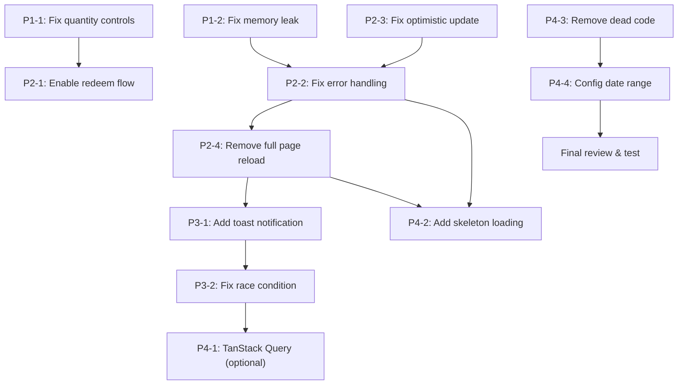

# Plan: Cải tiến trang Home — Check Reward Mini App

**Ngày tạo:** 2026-07-01
**Trạng thái:** Proposed (chưa implement)

---

## Mục lục

1. [Tổng quan](#tổng-quan)
2. [Priority 1 — Critical Bugs](#priority-1--critical-bugs)
3. [Priority 2 — High: State Management & UX](#priority-2--high-state-management--ux)
4. [Priority 3 — Medium: Data Fetching Architecture](#priority-3--medium-data-fetching-architecture)
5. [Priority 4 — Low: Polish & DX](#priority-4--low-polish--dx)
6. [Dependency Graph](#dependency-graph)
7. [Testing Strategy](#testing-strategy)

---

## Tổng quan

Danh sách vấn đề identified từ code review trang Home và các component liên quan:

| # | Mức độ | Vấn đề | File |
|---|---|---|---|
| 1 | 🔴 Critical | Quantity controls bị `disabled={true}` — user không thể chọn số lượng | `RewardList.tsx:492-509` |
| 2 | 🔴 Critical | Memory leak `createObjectURL` không `revokeObjectURL` | `UserCard.tsx:635` |
| 3 | 🟠 High | Optimistic update user points trước khi server confirm → không rollback khi fail | `RewardList.tsx:198-208` |
| 4 | 🟠 High | Error handling thiếu robust — `fetchUser` 401 nhưng `fetchRewards` vẫn chạy | `home/page.tsx:110-123` |
| 5 | 🟠 High | Full page reload (`window.location.reload()`) khi update profile | `UserCard.tsx:130` |
| 6 | 🟡 Medium | Race condition khi `onReload` gọi nhiều lần nhanh | `home/page.tsx:125-130` |
| 7 | 🟡 Medium | Alert-based UX thay vì toast notification | Nhiều file |
| 8 | 🟡 Medium | Manual field-by-field mapping trong setUser | `home/page.tsx:70-95` |
| 9 | 🟢 Low | Dead code: `loading` state bị comment | `home/page.tsx:44,118` |
| 10 | 🟢 Low | Không có skeleton loading cho RewardList | `RewardList.tsx` |
| 11 | 🟢 Low | Hardcoded date range trong RewardList header | `RewardList.tsx:226` |
| 12 | 🟢 Low | `sessionStorage.removeItem("rewards")` không có tác dụng | `RewardList.tsx:208` |

---

## Priority 1 — Critical Bugs

### Issue #1: Quantity Controls bị disable

**File:** [`src/components/RewardList.tsx`](src/components/RewardList.tsx:492)

**Current Code:**
```tsx
<div className="flex-1 flex items-center justify-center bg-gray-100 rounded-xl py-1.5 gap-1">
    <button onClick={decrease} disabled={true} className="...">-</button>
    <span className="...">{quantity}</span>
    <button onClick={increase} disabled={true} className="...">+</button>
</div>
```

**Root Cause:** `disabled={true}` hardcoded → user luôn redeem với quantity = 1.

**Fix:**
```tsx
<div className="flex-1 flex items-center justify-center bg-gray-100 rounded-xl py-1.5 gap-1">
    <button
        onClick={decrease}
        disabled={quantity <= 1}
        className="w-6 h-6 flex items-center justify-center rounded-lg text-xs text-gray-400"
    >
        -
    </button>
    <span className="w-6 text-center text-xs font-medium text-gray-700">
        {quantity}
    </span>
    <button
        onClick={increase}
        disabled={quantity >= reward.stock}
        className={`w-6 h-6 flex items-center justify-center rounded-lg text-xs ${
            quantity >= reward.stock ? 'text-gray-400' : 'text-gray-700'
        }`}
    >
        +
    </button>
</div>
```

**Validation bổ sung:**
- Button "Đổi ngay" cần hiển thị total points = `required_points * quantity`
- Need to update `handleRedeemClick` để check `userPoints < totalPoints` với quantity hiện tại

**Estimated effort:** 30 minutes

---

### Issue #2: Memory leak avatar preview

**File:** [`src/components/UserCard.tsx`](src/components/UserCard.tsx:53)

**Current Code:**
```tsx
const [avatarPreview, setAvatarPreview] = useState<string | null>(null);
// ...
setAvatarPreview(URL.createObjectURL(file)); // Không revoke
```

**Fix:**
```tsx
const [avatarPreview, setAvatarPreview] = useState<string | null>(null);

useEffect(() => {
    if (!avatarPreview) return;
    return () => URL.revokeObjectURL(avatarPreview);
}, [avatarPreview]);
```

**Estimated effort:** 10 minutes

---

## Priority 2 — High: State Management & UX

### Issue #3: Optimistic update không rollback khi server fail

**File:** [`src/components/RewardList.tsx`](src/components/RewardList.tsx:183)

**Current Code:**
```tsx
const handleRedeem = useCallback(async (reward: Reward, quantity: number) => {
    try {
        await redeemReward({ user_id, reward_id, quantity, name });

        // ← Update sau khi server OK → GOOD
        const totalPoints = reward.required_points * quantity;
        setUser(prev => {
            if (!prev) return prev;
            return {
                ...prev,
                available_point: prev.available_point - totalPoints,
                redeemed_point: prev.redeemed_point + totalPoints
            };
        });

        sessionStorage.removeItem("rewards"); // ← Dead code
        alert("Đổi quà thành công!");
        await onReload?.();
    } catch (error) {
        alert(error instanceof Error ? error.message : "Có lỗi xảy ra");
    }
}, [user, setUser, onReload]);
```

**Analysis:** Code hiện tại ĐÃ update sau server confirm → không có bug. Tuy nhiên:

1. `sessionStorage.removeItem("rewards")` — dead code, không có nơi nào đọc từ sessionStorage
2. Không có visual feedback (loading state) cho user đang xử lý

**Fix:**
```tsx
const handleRedeem = useCallback(async (reward: Reward, quantity: number) => {
    try {
        setIsSubmitting(true);
        await redeemReward({ user_id, reward_id, quantity, name });

        // Optimistic update after server confirm
        const totalPoints = reward.required_points * quantity;
        setUser(prev => prev ? {
            ...prev,
            available_point: prev.available_point - totalPoints,
            redeemed_point: prev.redeemed_point + totalPoints
        } : prev);

        alert("Đổi quà thành công!");
        await onReload?.();
    } catch (error) {
        alert(error instanceof Error ? error.message : "Có lỗi xảy ra");
    } finally {
        setIsSubmitting(false);
    }
}, [user, setUser, onReload, reward_id]);
```

**Cải tiến UI cho submit button:**
```tsx
<button
    onClick={handleSubmit}
    disabled={isSubmitting}
    className={`... ${isSubmitting ? 'opacity-50 cursor-wait' : ''}`}
>
    {isSubmitting ? "Đang xử lý..." : "Xác nhận"}
</button>
```

**Estimated effort:** 20 minutes

---

### Issue #4: Error handling thiếu robust

**File:** [`src/app/home/page.tsx`](src/app/home/page.tsx:110)

**Current Code:**
```tsx
useEffect(() => {
    const load = async () => {
        try {
            await Promise.all([fetchUser(), fetchRewards()]);
        } finally {
            // setLoading(false); ← DEAD CODE
        }
    };
    void load();
}, [fetchUser, fetchRewards]);
```

**Problems:**
1. Khi `fetchUser()` throw 401 → `router.replace("/login")` nhưng `fetchRewards()` vẫn chạy
2. Không có loading state (commented out)
3. Không có error state cho user-facing message

**Fix:**
```tsx
const [loading, setLoading] = useState(true);
const [error, setError] = useState<string | null>(null);

const fetchUser = useCallback(async () => {
    const res = await fetch("/api/users/me", { credentials: "include" });

    if (res.status === 401) {
        router.replace("/login");
        return null;
    }

    if (!res.ok) {
        setError("Không thể tải dashboard. Vui lòng thử lại.");
        throw new Error("Failed to load dashboard");
    }

    const data = await res.json() as UserDashboardResponse;

    setUser(prev => ({
        id: data.user.id,
        telegram_id: data.user.telegram_id,
        telegram_name: data.user.telegram_name,
        uid: data.user.uid,
        name: data.user.name || "Thành viên",
        email: data.user.email || "",
        address: data.user.address || "",
        phone: data.user.phone || "",
        role: data.user.role,
        available_point: data.user.available_point,
        earned_point: data.user.earned_point,
        redeemed_point: data.user.redeemed_point,
        avatar_url: data.user.avatar_url,
    }));

    setDashboard(data);
    return data;
}, [router, setUser]);

const fetchRewards = useCallback(async () => {
    try {
        const list = await getRewards();
        setRewards(list);
    } catch {
        setRewards([]);
        setError("Không thể tải danh sách quà. Vui lòng thử lại.");
    }
}, []);

useEffect(() => {
    const load = async () => {
        try {
            setLoading(true);
            setError(null);
            const dashboardData = await fetchUser();

            // Only fetch rewards if user is authenticated
            if (dashboardData) {
                await fetchRewards();
            }
        } catch {
            // Error already set in fetchUser/fetchRewards
        } finally {
            setLoading(false);
        }
    };

    void load();
}, [fetchUser, fetchRewards]);
```

**Loading skeleton:**
```tsx
if (loading) {
    return (
        <div className="h-screen flex flex-col bg-gray-100">
            <Header />
            <div className="animate-pulse p-4 space-y-4">
                <div className="h-32 bg-gray-200 rounded-2xl" />
                <div className="h-24 bg-gray-200 rounded-2xl" />
                <div className="h-96 bg-gray-200 rounded-2xl" />
            </div>
        </div>
    );
}

if (error) {
    return (
        <div className="h-screen flex flex-col bg-gray-100">
            <Header />
            <div className="p-4 text-center text-red-500">
                <p>{error}</p>
                <button onClick={() => window.location.reload()} className="mt-2 px-4 py-2 bg-red-100 rounded-lg">
                    Thử lại
                </button>
            </div>
        </div>
    );
}
```

**Estimated effort:** 45 minutes

---

### Issue #5: Full page reload khi update profile

**File:** [`src/components/UserCard.tsx`](src/components/UserCard.tsx:107)

**Current Code:**
```tsx
const handleUpdateProfile = async () => {
    try {
        setLoading(true);
        const res = await fetch("/api/users/update-profile", { ... });
        if (!res.ok) throw new Error();
        window.location.reload(); // ← Full page reload
    } catch {
        alert("Không cập nhật được thông tin");
    } finally {
        setLoading(false);
    }
};
```

**Fix:**
```tsx
const handleUpdateProfile = async () => {
    try {
        setLoading(true);
        const res = await fetch("/api/users/update-profile", {
            method: "PUT",
            headers: { "Content-Type": "application/json" },
            body: JSON.stringify(form),
        });

        if (!res.ok) {
            const errorData = await res.json();
            throw new Error(errorData.error || "Không cập nhật được thông tin");
        }

        // Optimistic update instead of full reload
        setUser(prev => prev ? {
            ...prev,
            name: form.name,
            email: form.email,
            address: form.address,
            phone: form.phone,
        } : prev);

        setEditOpen(false);
        setForm({ name: form.name, email: form.email, address: form.address, phone: form.phone, uid: form.uid });
    } catch (err) {
        alert(err instanceof Error ? err.message : "Không cập nhật được thông tin");
    } finally {
        setLoading(false);
    }
};
```

**Tương tự cho avatar upload (dòng 222-252):**
```tsx
const handleUploadAvatar = async () => {
    if (!avatarFile) return;

    try {
        setAvatarLoading(true);
        const formData = new FormData();
        formData.append("file", avatarFile);

        const res = await fetch("/api/users/avatar", {
            method: "POST",
            body: formData,
        });

        const data = await res.json();

        if (!res.ok || !data.success) {
            throw new Error(data.message || "Upload thất bại");
        }

        // Optimistic update
        setUser(prev => prev ? { ...prev, avatar_url: data.url } : prev);

        setAvatarOpen(false);
        setAvatarFile(null);
        setAvatarPreview(null);
    } catch (err) {
        alert(err instanceof Error ? err.message : "Có lỗi xảy ra");
    } finally {
        setAvatarLoading(false);
    }
};
```

**Estimated effort:** 30 minutes

---

## Priority 3 — Medium: Data Fetching Architecture

### Issue #6: Race condition khi onReload gọi nhiều lần

**File:** [`src/app/home/page.tsx`](src/app/home/page.tsx:125)

**Current Code:**
```tsx
const reloadDashboard = useCallback(async () => {
    await Promise.all([fetchUser(), fetchRewards()]);
}, [fetchUser, fetchRewards]);
```

**Fix Option A (AbortController):**
```tsx
const abortControllerRef = React.useRef<AbortController | null>(null);

const reloadDashboard = useCallback(async () => {
    // Cancel previous in-flight requests
    abortControllerRef.current?.abort();
    abortControllerRef.current = new AbortController();
    const { signal } = abortControllerRef.current;

    try {
        await Promise.all([
            fetchUser(),
            fetchRewards(),
        ]);
    } catch (err) {
        if (err instanceof Error && err.name === 'AbortError') {
            // Request was cancelled, ignore
            return;
        }
        throw err;
    }
}, [fetchUser, fetchRewards]);
```

**Fix Option B (Recommended — TanStack Query):**

Sử dụng TanStack Query để tự động:
- Dedupe requests
- Stale-while-revalidate caching
- Automatic retry
- Background refetch on focus

```bash
npm install @tanstack/react-query
```

```tsx
// src/app/home/page.tsx
import { useQuery, useQueryClient } from "@tanstack/react-query";
import { fetchUserMe } from "@/app/services/auth";
import { getRewards } from "@/app/services/reward";

const QUERY_KEYS = {
    userMe: ['userMe'] as const,
    rewards: ['rewards'] as const,
};

export default function HomePage() {
    const queryClient = useQueryClient();

    const { data: dashboard, isLoading, error } = useQuery({
        queryKey: QUERY_KEYS.userMe,
        queryFn: fetchUserMe,
    });

    const { data: rewards = [], isLoading: rewardsLoading } = useQuery({
        queryKey: QUERY_KEYS.rewards,
        queryFn: getRewards,
    });

    const reloadDashboard = () => {
        queryClient.invalidateQueries({ queryKey: QUERY_KEYS.userMe });
        queryClient.invalidateQueries({ queryKey: QUERY_KEYS.rewards });
    };

    // ... rest of component
}
```

**Estimated effort (Option A):** 30 minutes
**Estimated effort (Option B):** 2-3 hours (requires refactoring multiple components)

---

### Issue #7: Alert-based UX → Toast Notification

**Files affected:**
- `UserCard.tsx` — profile update, password change, avatar upload
- `RewardList.tsx` — redeem success/fail
- `RewardHistory.tsx` — history display

**Fix:** Tạo custom Toast component hoặc sử dụng `sonner`:

```bash
npm install sonner
```

```tsx
// src/components/Toast.tsx
"use client";
import { Toaster } from "sonner";

export function ToastProvider() {
    return <Toaster position="top-center" richColors />;
}
```

```tsx
// Replace: alert("Đổi quà thành công!")
// With: toast.success("Đổi quà thành công!");

// Replace: alert("Không cập nhật được thông tin")
// With: toast.error("Không cập nhật được thông tin");
```

**Update root layout:**
```tsx
// src/app/layout.tsx
import { ToastProvider } from "@/components/Toast";

export default function RootLayout({ children }) {
    return (
        <html>
            <body>
                <ToastProvider />
                {children}
            </body>
        </html>
    );
}
```

**Estimated effort:** 1 hour

---

### Issue #8: Manual field-by-field mapping

**File:** [`src/app/home/page.tsx`](src/app/home/page.tsx:70)

**Current Code:**
```tsx
setUser((prev) => {
    return {
        id: data.user.id,
        telegram_id: data.user.telegram_id,
        // ... 12 fields manually mapped
    };
});
```

**Fix Option A (Simple):**
```tsx
setUser(data.user); // Direct assignment if types match
```

**Fix Option B (TanStack Query):**
Khi chuyển sang TanStack Query (Issue #6), UserContext chỉ cần lưu auth token, data sẽ từ cache.

**Estimated effort (Option A):** 15 minutes
**Estimated effort (Option B):** Included in Issue #6

---

## Priority 4 — Low: Polish & DX

### Issue #9: Dead code loading state

**File:** [`src/app/home/page.tsx`](src/app/home/page.tsx:44)

**Fix:** Khi implement Issue #4, loading state sẽ được reintroduce. Xóa dòng comment.

**Estimated effort:** 5 minutes

---

### Issue #10: Skeleton loading cho RewardList

**File:** [`src/components/RewardList.tsx`](src/components/RewardList.tsx)

**Fix:**
```tsx
// Add to RewardList props
interface RewardListProps {
    rewards: Reward[];
    redeemedRewardIds: Set<string>;
    onReload?: () => Promise<void>;
    loading?: boolean; // ← New prop
}

// Add loading skeleton
if (loading) {
    return (
        <div className="mx-3 mt-4 space-y-3">
            {[1, 2, 3].map(i => (
                <div key={i} className="animate-pulse bg-white rounded-2xl p-4">
                    <div className="h-4 bg-gray-200 rounded w-3/4 mb-2" />
                    <div className="h-3 bg-gray-200 rounded w-1/2 mb-3" />
                    <div className="flex justify-between">
                        <div className="h-3 bg-gray-200 rounded w-1/4" />
                        <div className="w-24 h-24 bg-gray-200 rounded-xl" />
                    </div>
                </div>
            ))}
        </div>
    );
}
```

**Estimated effort:** 30 minutes

---

### Issue #11: Hardcoded date range

**File:** [`src/components/RewardList.tsx`](src/components/RewardList.tsx:226)

**Fix Option A (Config):**
```tsx
// src/config/events.ts
export const EVENT_CONFIG = {
    name: "Check Reward Event",
    startDate: new Date("2026-06-01"),
    endDate: new Date("2026-06-30"),
};
```

```tsx
// In RewardList
import { EVENT_CONFIG } from "@/config/events";
<span>Thời gian event: {EVENT_CONFIG.startDate.toLocaleDateString('vi-VN', {day: '2-digit', month: '2-digit', year: 'numeric'})} - {EVENT_CONFIG.endDate.toLocaleDateString('vi-VN', {day: '2-digit', month: '2-digit', year: 'numeric'})}</span>
```

**Fix Option B (Props):**
```tsx
// home/page.tsx
<RewardList
    rewards={rewards}
    redeemedRewardIds={redeemedRewardIds}
    onReload={reloadDashboard}
    eventLabel="Thời gian event: 01/06 - 30/06/2026"
/>
```

**Estimated effort:** 20 minutes

---

### Issue #12: Dead code sessionStorage

**File:** [`src/components/RewardList.tsx`](src/components/RewardList.tsx:208)

**Fix:** Xóa dòng `sessionStorage.removeItem("rewards");` — không có nơi nào đọc từ sessionStorage.

**Estimated effort:** 2 minutes

---

## Dependency Graph



---

## Recommended Implementation Order

| Step | Task | Time |
|---|---|---|
| 1 | Fix quantity controls (P1-1) | 30 min |
| 2 | Fix memory leak avatar preview (P1-2) | 10 min |
| 3 | Fix error handling home page (P2-2) | 45 min |
| 4 | Remove full page reload (P2-4) | 30 min |
| 5 | Clean up dead code (P4-3) | 15 min |
| 6 | Add skeleton loading (P4-2) | 30 min |
| 7 | Add toast notification (P3-1) | 1 hour |
| 8 | Fix race condition (P3-2) | 30 min |
| 9 | Config date range (P4-4) | 20 min |
| 10 | **Optional:** TanStack Query migration (P4-1) | 2-3 hours |

**Total estimated effort (without TanStack Query):** ~3.5 hours
**Total estimated effort (with TanStack Query):** ~5-6 hours

---

## Testing Strategy

### Unit Tests (recommended)
- [ ] Test `handleRedeem` with various quantity values
- [ ] Test `redeemedRewardIds` memoization
- [ ] Test quantity increase/decrease boundary conditions

### Integration Tests (recommended)
- [ ] Test full redeem flow: select quantity → click redeem → confirm → UI update
- [ ] Test profile update → optimistic state update → verify UI
- [ ] Test avatar upload → optimistic update → verify avatar display

### Manual Tests
- [ ] Verify quantity controls work correctly (enable/disable based on stock)
- [ ] Verify user points update correctly after redeem
- [ ] Verify no memory leaks in DevTools → Memory tab
- [ ] Verify no full page reload on profile/avatar update
- [ ] Verify error messages display correctly (toast vs alert)
- [ ] Verify loading skeleton shows during initial load
- [ ] Verify error screen shows on 401/500 responses

---

## Files cần sửa

| File | Changes |
|---|---|
| `src/app/home/page.tsx` | Error handling, loading state, skeleton |
| `src/components/UserCard.tsx` | Avatar memory leak, optimistic update, toast |
| `src/components/RewardList.tsx` | Quantity controls, dead code cleanup, skeleton |
| `src/app/layout.tsx` | Add ToastProvider (if use sonner) |
| `src/config/events.ts` | (New) Event configuration |
| `src/app/services/auth.ts` | (Optional) TanStack Query fn |
| `src/app/services/reward.ts` | (Optional) TanStack Query fn |

---

## Không làm (Out of Scope)

Những cải tiến được đề xuất trong [`code-review-issues.md`](plans/code-review-issues.md) nhưng KHÔNG nằm trong plan này:

1. JWT expire time (liên quan auth flow, không phải home page)
2. SSL `rejectUnauthorized` (infrastructure level)
3. Admin middleware (security layer)
4. Rate limiting (infrastructure)
5. Database migration system
6. Prisma cleanup

Những vấn đề trên sẽ được handle trong một plan riêng.
