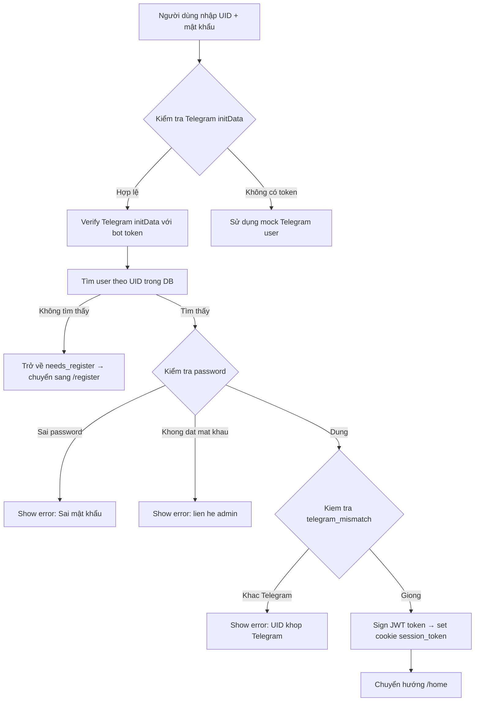
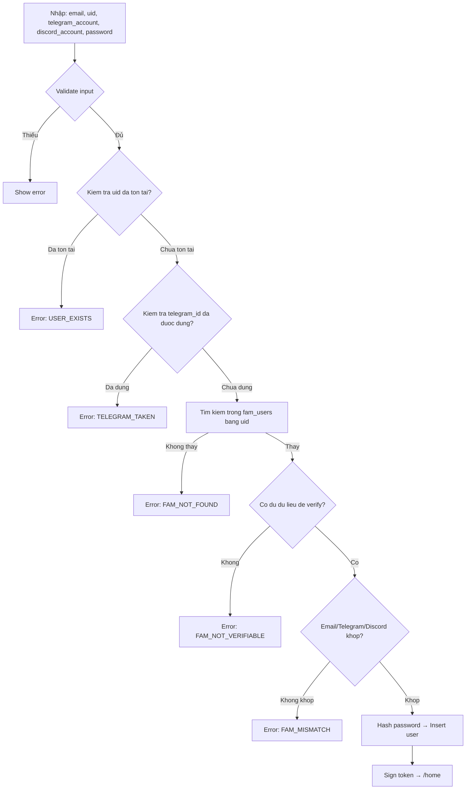

# Tóm tắt Dự án Check Reward Mini App

## 1. Giới thiệu

Đây là một **Telegram Mini App** xây dựng bằng **Next.js 16** (App Router), cho phép người dùng đăng nhập qua tài khoản BingX (UID + mật khẩu), tích lũy điểm dựa trên **volume giao dịch**, và đổi quà (reward) trong hệ thống. Admin có thể quản lý người dùng, duyệt yêu cầu đổi quà, quản lý quà tặng, và import volume từ file CSV.

---

## 2. Công nghệ & Thư viện

| Nhóm | Công nghệ |
|---|---|
| Framework | Next.js 16 (App Router), React 19 |
| CSS | Tailwind CSS 4, framer-motion |
| Database | PostgreSQL (Prisma ORM config sẵn, nhưng code hiện dùng raw SQL) |
| Auth | JWT (jsonwebtoken), bcryptjs |
| Telegram | Telegram WebApp SDK (load qua CDN) |
| File | ExcelJS, Papaparse (CSV), file-saver |
| Icons | lucide-react |

---

## 3. Cấu trúc thư mục chính

```
check_reward_mini_app/
├── prisma/schema.prisma              # Prisma config (PostgreSQL, chưa dùng fully)
├── schema_database/schema.sql        # Notes DB schema (constraint unique_user_reward)
├── src/
│   ├── app/
│   │   ├── layout.tsx                # Root layout, UserProvider, BottomNav
│   │   ├── page.tsx                  # Redirect đến /login
│   │   ├── login/page.tsx            # Trang đăng nhập
│   │   ├── register/page.tsx         # Trang đăng ký (FAM verification)
│   │   ├── home/page.tsx             # Dashboard chính (UserCard + RewardList)
│   │   ├── admin/page.tsx            # Trang admin (tab: redeem, users, stats, import)
│   │   ├── reward/page.tsx           # Trang reward (chưa rõ nội dung)
│   │   ├── api/                      # Tất cả API routes
│   │   │   ├── auth/login/route.ts
│   │   │   ├── auth/register/route.ts
│   │   │   ├── auth/logout/route.ts
│   │   │   ├── rewards/route.ts
│   │   │   ├── redeem/route.ts
│   │   │   ├── upload/route.ts
│   │   │   ├── users/me/route.ts
│   │   │   ├── users/update-profile/route.ts
│   │   │   ├── users/change-password/route.ts
│   │   │   ├── users/avatar/route.ts
│   │   │   └── admin/
│   │   │       ├── redeem-requests/route.ts
│   │   │       ├── redeem-requests/[id]/approve/route.ts
│   │   │       ├── redeem-requests/[id]/reject/route.ts
│   │   │       ├── users/route.ts
│   │   │       ├── users/[id]/route.ts
│   │   │       ├── rewards/route.ts
│   │   │       ├── rewards/[id]/route.ts
│   │   │       ├── stats/route.ts
│   │   │       ├── export-stats/route.ts
│   │   │       └── import-volume/route.ts
│   │   └── services/                 # Client-side API services
│   │       ├── auth.ts
│   │       ├── reward.ts
│   │       ├── redeem.ts
│   │       └── admin.ts
│   ├── components/                   # UI Components
│   │   ├── Header.tsx
│   │   ├── BottomNav.tsx
│   │   ├── UserCard.tsx
│   │   ├── RewardList.tsx
│   │   ├── RewardList_no_admin_reward.tsx
│   │   ├── RewardHistory.tsx
│   │   ├── PointsCard.tsx
│   │   ├── RedeemRequestTable.tsx
│   │   ├── UserManagementTable.tsx
│   │   ├── ApprovedRedeemStatsTable.tsx
│   │   ├── ImportVolumeTab.tsx
│   │   └── Button.tsx
│   ├── context/UserContext.tsx       # React Context cho user state
│   ├── lib/                          # Core utilities
│   │   ├── db.ts                     # PG connection pool, query/execute/withTransaction
│   │   ├── auth.ts                   # JWT sign/verify, getCurrentUser
│   │   ├── telegram.ts               # Verify Telegram initData
│   │   ├── fam-verify.ts             # FAM (BingX) account verification
│   │   ├── password.ts               # Hash/verify password
│   │   ├── validators.ts             # Email, phone validation
│   │   ├── repository.ts             # Repository pattern — user, reward, redeem logic
│   │   ├── volume.repository.ts      # Volume upsert logic
│   │   └── helpers.ts
│   ├── services/                     # Server-side services
│   │   ├── user.service.ts           # Auth, profile, redeem, admin logic
│   │   └── volume.service.ts         # Volume import service
│   ├── types/
│   │   ├── user.ts
│   │   └── reward.ts
│   ├── db/schema.ts                  # Type definitions cho DB entities
│   └── middleware.ts
└── public/images/                    # Avatar & reward images
```

---

## 4. Database Schema (Các bảng chính)

Dựa trên phân tích code, các bảng chính bao gồm:

### 4.1 `users`
| Cột | Mô tả |
|---|---|
| `id` | UUID primary key |
| `telegram_id` | ID từ Telegram |
| `telegram_name` | Tên Telegram |
| `uid` | UID BingX (unique) |
| `name` | Tên hiển thị |
| `role` | `"user"` hoặc `"admin"` |
| `earned_point` | Tổng điểm đã tích lũy |
| `redeemed_point` | Điểm đã sử dụng |
| `available_point` | Điểm khả dụng = `earned_point - redeemed_point` |
| `email`, `phone_number`, `address` | Thông tin cá nhân |
| `avatar_url` | Link avatar |
| `password_hash` | Hash mật khẩu |
| `created_at`, `updated_at` | Thời gian |

### 4.2 `rewards`
| Cột | Mô tả |
|---|---|
| `id` | UUID |
| `name`, `description`, `image_url` | Thông tin quà |
| `required_points` | Số điểm cần để đổi |
| `stock` | Số lượng tồn |
| `is_active` | Soft delete flag |

### 4.3 `redeem_requests`
| Cột | Mô tả |
|---|---|
| `id` | UUID |
| `user_id` | FK → users |
| `reward_id` | FK → rewards |
| `quantity` | Số lượng quà muốn đổi |
| `status` | `"pending"`, `"approved"`, `"rejected"` |
| `proof_image`, `shipping_info` | Thông tin bằng chứng/địa chỉ |
| `admin_note` | Ghi chú admin |
| **UNIQUE** | `(user_id, reward_id)` — mỗi user chỉ đổi 1 lần/reward |

### 4.4 `user_points_history`
| Cột | Mô tả |
|---|---|
| `id` | UUID |
| `user_id` | FK → users |
| `reward_id` | FK → rewards |
| `points_change` | Số điểm dương/âm |
| `source` | `"redeem"`, `"refund"`, v.v. |
| `description` | Mô tả |

### 4.5 `user_volume_agg`
| Cột | Mô tả |
|---|---|
| `id` | UUID |
| `uid` | UID BingX (unique/primary) |
| `total_volume_usd` | Tổng volume USD |
| `total_orders` | Số đơn hàng |

### 4.6 `fam_users`
| Cột | Mô tả |
|---|---|
| `uid` | UID BingX |
| `email` | Email BingX |
| `telegram_account` | Tài khoản Telegram |
| `discord_account` | Tài khoản Discord |

---

## 5. Luồng hoạt động chính

### 5.1 Đăng nhập (Login Flow)



### 5.2 Đăng ký (Register Flow — FAM Verification)



### 5.3 Dashboard (Trang Chủ)

```mermaid
graph TD
    A[Trang /home] --> B[Goi /api/users/me → lấy UserDashboardResponse]
    B --> C[Update user state trong Context]
    B --> D[Goi /api/rewards → lay danh sách quà]
    B --> E[Show: UserCard (điểm, volume, avatar)]
    B --> F[Show: RewardList danh sách quà]
    E --> G[UserCard: Xem history, sua thong tin, doi mat khau, upload avatar, logout]
    F --> H[User: Click đổi quà → /api/redeem → tao yeu cau]
    F --> I[Admin:Them/sua/xoa quà → /api/admin/rewards]
```

### 5.4 Đổi Quà (Redeem Flow)

```mermaid
graph TD
    A[User click đổi quà] --> B[POST /api/redeem { user_id, reward_id, quantity }]
    B --> C[UserService.createRequest]
    C --> D{User ton tai?}
    D -->|Khong| E[Error: User not found]
    D -->|Co| F{Reward ton tai?}
    F -->|Khong| G[Error: Reward not found]
    F -->|Co| H{Enough available_point?}
    H -->|Khong| I[Error: Not enough points]
    H -->|Co| J{Stock du?}
    J -->|Khong| K[Error: Out of stock]
    J -->|Du| L[BEGIN Transaction]
    L --> M[Decrement reward stock]
    M --> N[Adjust redeemed_point tăng, available_point giảm]
    N --> O{Kiem tra unique constraint}
    O -->|Duplicate 23505| P[Error: Đã đổi quà này rồi]
    O -->|Thanh cong| Q[Create redeem_requests status=pending]
    Q --> R[Insert point history source=redeem]
    R --> S[COMMIT]
    S --> T[Trả về success]
```

### 5.5 Admin: Duyệt yêu cầu đổi quà

```mermaid
graph TD
    A[Admin xem danh sách redeem_requests] --> B{Hanh dong}
    B -->|Approve| C[POST /api/admin/redeem-requests/:id/approve]
    B -->|Reject| D[POST /api/admin/redeem-requests/:id/reject]
    C --> E{Status == pending?}
    E -->|Khong| F[Error: already processed]
    E -->|Co| G[Update status=approved]
    G --> H[Insert history source=refund]
    H --> I[Success]
    D --> J{Status == pending?}
    J -->|Khong| K[Error: already processed]
    J -->|Co| L[Refund redeemed_point (tăng available_point)]
    L --> M[Increase reward stock]
    M --> N[Update status=rejected]
    N --> O[Insert history source=refund]
    O --> P[Success]
```

### 5.6 Import Volume từ CSV

```mermaid
graph TD
    A[Admin upload file CSV qua ImportVolumeTab] --> B[Parse CSV bằng Papaparse]
    B --> C[POST /api/admin/import-volume { rows }]
    C --> D[VolumeService.importTransactions]
    D --> E[Parse volume: xử lý định dạng VN 99.073.049 → 99073049]
    E --> F[Group by UID, aggregate volume]
    F --> G[BEGIN Transaction]
    G --> H[Upsert user_volume_agg: INSERT ... ON CONFLICT UPDATE cộng dồn]
    H --> I[COMMIT]
    I --> J[Trả về { inserted, skipped }]
```

### 5.7 Đồng bộ điểm tự động (Auto Points Sync)

Khi user vào trang `/home`:
1. Lấy `volume` từ `user_volume_agg` theo UID
2. Nếu `volume > earned_point` → tự động `UPDATE users SET earned_point = volume`
3. `available_point = earned_point - redeemed_point`

Đây là cách hệ thống tự động cập nhật điểm dựa trên volume giao dịch.

---

## 6. Chi tiết API Routes

### 6.1 Authentication

| Method | Endpoint | Mô tả |
|---|---|---|
| POST | `/api/auth/login` | Đăng nhập UID + password, verify Telegram |
| POST | `/api/auth/register` | Đăng ký mới với FAM verification |
| POST | `/api/auth/logout` | Đăng xuất (xoá cookie) |

### 6.2 User APIs

| Method | Endpoint | Mô tả |
|---|---|---|
| GET | `/api/users/me` | Lấy thông tin user hiện tại + dashboard |
| PUT | `/api/users/update-profile` | Cập nhật profile (name, email, phone, address) |
| PUT | `/api/users/change-password` | Đổi mật khẩu |
| PUT | `/api/users/avatar` | Upload thay đổi avatar |

### 6.3 Reward APIs (User)

| Method | Endpoint | Mô tả |
|---|---|---|
| GET | `/api/rewards` | Lấy danh sách reward đang active |
| POST | `/api/redeem` | Tạo yêu cầu đổi quà |

### 6.4 Admin APIs

| Method | Endpoint | Mô tả |
|---|---|---|
| GET | `/api/admin/redeem-requests` | Lấy danh sách yêu cầu đổi quà (phân trang, filter status) |
| POST | `/api/admin/redeem-requests/:id/approve` | Duyệt yêu cầu |
| POST | `/api/admin/redeem-requests/:id/reject` | Từ chối yêu cầu |
| GET | `/api/admin/users` | Quản lý user (phân trang, search uid) |
| POST | `/api/admin/users` | Tạo user mới (admin) |
| PUT | `/api/admin/users/:id` | Cập nhật user |
| DELETE | `/api/admin/users/:id` | Xoá user |
| GET | `/api/admin/rewards` | Lấy danh sách rewards (bao gồm inactive) |
| POST | `/api/admin/rewards` | Tạo reward mới |
| PUT | `/api/admin/rewards/:id` | Cập nhật reward |
| DELETE | `/api/admin/rewards/:id` | Soft-delete reward |
| GET | `/api/admin/stats` | Thống kê các yêu cầu đã approve |
| GET | `/api/admin/export-stats` | Export stats |
| POST | `/api/admin/import-volume` | Import volume từ CSV |

### 6.5 Upload

| Method | Endpoint | Mô tả |
|---|---|---|
| POST | `/api/upload` | Upload ảnh reward (admin only, max 2MB: jpg/png/webp) |

---

## 7. Service Layer Architecture

### 7.1 `userService` (src/services/user.service.ts)

Lớp service chính, đảm nhận:
- **Auth**: `loginWithUidPassword`, `registerWithFamVerification`
- **Profile**: `updateProfile`, `changePassword`, `updateAvatar`
- **Dashboard**: `getDashboard` — lấy user info + history + volume + auto-sync điểm
- **Redeem**: `createRequest`, `approveRequest`, `rejectRequest`
- **Admin**: `getRedeemRequests`, `getUsers`, `createUserByAdmin`, `updateUserAdmin`, `deleteUser`, `getApprovedRedeemStats`
- **Rewards**: `getAvailableRewards`, `createReward`, `updateReward`, `deleteReward`

### 7.2 `volumeService` (src/services/volume.service.ts)

- `importTransactions(rows)`: Parse CSV, nhóm theo UID, upsert vào `user_volume_agg`
- Xử lý định dạng số VN (dấu chấm là phân cách nghìn): `"99.073.049"` → `99073049`

### 7.3 `userRepository` (src/lib/repository.ts)

Repository pattern, dùng raw SQL với parameterized queries:
- CRUD cho `users`, `rewards`, `redeem_requests`, `user_points_history`
- `syncEarnedPoints`: Cập nhật earned_point từ volume
- `adjustRedeemedPoints`: Tăng/giảm redeemed_point
- `decrease/increaseRewardStockSafe`: Trừ/tăng stock an toàn
- Pagination + filtering

### 7.4 `volumeRepository` (src/lib/volume.repository.ts)

- `upsertUserVolume`: Upsert với ON CONFLICT UPDATE (cộng dồn volume)

### 7.5 DB Layer (src/lib/db.ts)

- PG Pool connection (max 20 connections)
- `query()`, `queryOne()`, `execute()` — wrappers cho pg queries
- `withTransaction()` — BEGIN/COMMIT/ROLLBACK wrapper

---

## 8. Component Hierarchy

```
RootLayout (UserProvider, Script Telegram JS, BottomNav)
├── LoginPage
├── RegisterPage
│   └── Suspense → RegisterContent
├── HomePage
│   ├── Header
│   ├── UserCard (points, volume, profile, avatar, change password, logout)
│   ├── RewardList (danh sách quà, redeem, admin CRUD)
│   │   └── Modal: Add/Edit Reward (upload ảnh, form)
│   └── RewardHistory (modal)
├── AdminPage
│   ├── Header
│   ├── Tab Nav (redeem, users, stats, import)
│   ├── RedeemRequestTable (admin: approve/reject)
│   ├── UserManagementTable (admin: edit/delete/create user)
│   ├── ApprovedRedeemStatsTable (thống kê)
│   └── ImportVolumeTab (upload CSV)
└── RewardPage (placeholder?)
```

---

## 9. Authentication & Authorization

- **JWT Token**: Lưu trong HTTP-only cookie (`session_token`), expires 15 phút
- **Telegram Verification**: Verify `initData` từ Telegram WebApp bằng HMAC-SHA256
- **Role-based Access**:
  - `user`: Đăng nhập, xem đổi quà, cập nhật profile
  - `admin`: Truy cập admin routes, CRUD rewards, approve/reject, import volume

---

## 10. Bảo mật & Constraints

1. **Unique constraint** trên `redeem_requests(user_id, reward_id)` — user chỉ đổi 1 lần/reward
2. **FAM Verification** — đăng ký yêu cầu email/telegram/discord khớp với `fam_users`
3. **Telegram mismatch check** — UID đăng nhập phải khớp Telegram đang mở app
4. **Soft delete** cho rewards (`is_active = false`)
5. **Transaction-safe** redeem flow: stock + points + request + history trong 1 transaction
6. **Input validation**: email, phone (VN format), required fields

---

## 11. UI/UX Design

- **Mobile-first**: Max width `max-w-md` trên mobile, mở rộng đến `xl:max-w-7xl`
- **Telegram Mini App**: Dùng `window.Telegram.WebApp`
- **Bottom Navigation**: Home, Admin (chỉ hiện cho admin role)
- **Gradient Header**: Blue gradient `from-blue-500 to-blue-700`
- **Animations**: framer-motion (có sẵn)
- **Dynamic import**: RewardList được lazy load
- **Header caching disabled**: Tất cả pages không cache (`Cache-Control: no-store`)

---

## 12. Files chưa hoàn thiện / Cần lưu ý

| File | Ghi chú |
|---|---|
| [`prisma/schema.prisma`](prisma/schema.prisma) | Chỉ có cấu trúc cơ bản, không định nghĩa models — dự án dùng raw SQL |
| [`src/app/api/admin/rewards/route.ts`](src/app/api/admin/rewards/route.ts) | File rỗng — PUT/DELETE reward có thể ở [`[id]/route.ts`](src/app/api/admin/rewards/[id]/route.ts) |
| [`src/app/reward/page.tsx`](src/app/reward/page.tsx) | Chưa rõ nội dung (có thể là placeholder) |
| Schema DB | Schema thật nằm ở PostgreSQL, chỉ có notes trong [`schema.sql`](schema_database/schema.sql) |
| Dockerfile | Có sẵn nhưng cần kiểm tra config cho standalone output |

---

## 13. Tóm tắt Logic Kinh nghiệm (Business Logic)

1. **User đăng ký** → cần khớp FAM data (email/telegram/discord của BingX)
2. **User đăng nhập** → UID + mật khẩu BingX + kiểm tra Telegram ID khớp
3. **Điểm thưởng** → Tự động sync từ `total_volume_usd` trong `user_volume_agg` (admin import từ CSV)
4. **Đổi quà** → Trừ điểm → Tạo yêu cầu `pending` → Admin phê duyệt/từ chối
5. **Approve** → Giữ điểm, cập nhật status
6. **Reject** → Hoàn điểm cho user, tăng lại stock reward
7. **Mỗi user chỉ được đổi 1 lần/reward** (unique constraint)
8. **Admin có thể import volume CSV** → Cộng dồn theo UID
